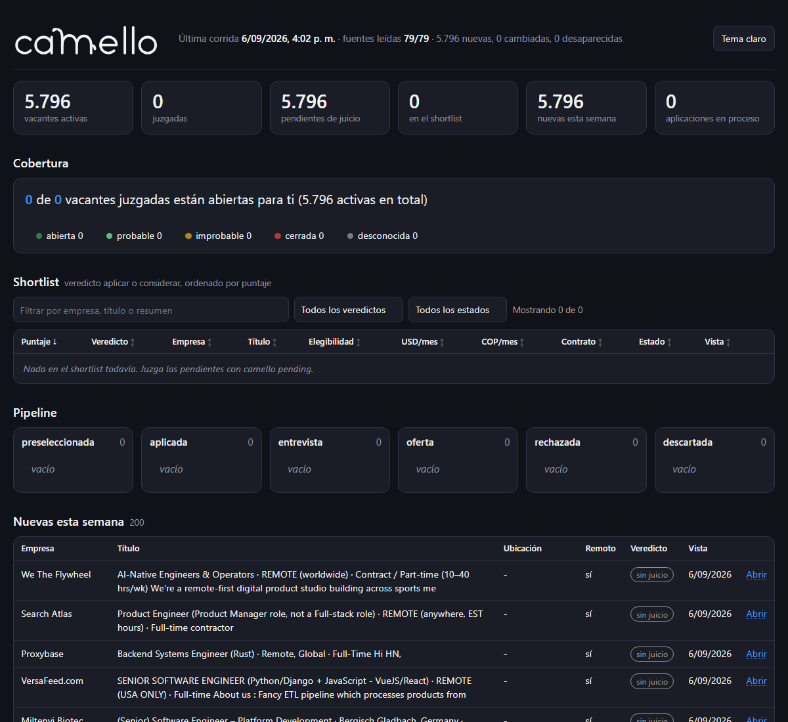

<p align="center">
  
</p>

# camello

CLI local-first para buscar trabajo remoto desde Colombia. Descarga vacantes de feeds públicos, las guarda en SQLite en tu máquina y deja que tu agente de código (Claude Code, Cursor o similar) evalúe cada una contra tu perfil. Después adapta tu hoja de vida a la vacante que elijas.

Para cada vacante el agente responde tres preguntas y cita la frase del anuncio que lo justifica.

1. Si puedes aplicar desde Colombia (abierta, probable, improbable o cerrada).
2. Cuánto pagan, en USD y COP, y si la banda es de EE. UU. o de LATAM.
3. Qué tanto encajas, con puntaje de 0 a 100, fortalezas y brechas.

## Requisitos

- Node 22.13 o superior. No hay dependencias de runtime.
- Un agente de código para el análisis y la hoja de vida. `camello` no llama a ninguna API de modelos y usa la suscripción que ya tienes. Sin agente puedes descargar vacantes, buscarlas y ver el tablero, pero nada se evalúa.

## Instalación

```bash
git clone git@github.com:Azg-stdio/camello.git
cd camello
npm install && npm run build
npm link              # deja el comando `camello` disponible en la terminal
camello init          # asistente de 12 preguntas, escribe profile/ y config.local.json
```

`profile/` y `config.local.json` están ignorados por git.

## Uso

Sin agente, comandos normales de Node.

```bash
camello profile check   # valida el perfil
camello refresh         # descarga las vacantes, unos minutos la primera vez
camello dashboard       # abre el tablero en el navegador
```

Con agente. Copia la carpeta `skill/` a `.claude/skills/camello/` (Claude Code) o al equivalente de tu herramienta. `camello skill` imprime la ruta.

| Le dices al agente | Qué hace |
|--------------------|----------|
| "importa mi hoja de vida desde CV.pdf" | Lee el PDF y escribe `profile/cv.md` con un banco de logros por empleo. |
| "busca trabajo nuevo" | Corre `refresh`, juzga las pendientes siguiendo [skill/juicio.md](skill/juicio.md) y muestra el shortlist. |
| "prepara mi hoja de vida para Wikimedia" | Adapta el CV siguiendo [skill/cv.md](skill/cv.md), muestra qué logros escogió, verifica que no agregó nada y deja el HTML listo para imprimir a PDF. |
| "ya apliqué a esa" | Mueve la vacante en el pipeline. |

El agente juzga 20 vacantes por corrida, empezando por las que mencionan tu stack. El límite y las prioridades están en `config.json`.

## Tablero

<p align="center">
  
</p>

Muestra cobertura (cuántas de las juzgadas están abiertas para ti), shortlist con puntaje, elegibilidad, pago, contrato y evidencia, pipeline por estado y vacantes nuevas de la semana. Las ofertas por debajo de tu salario esperado se marcan y se pueden ocultar con una casilla.

## Comandos

| Comando | Qué hace |
|---------|----------|
| `camello init [--yes]` | Asistente inicial. Con `--yes` usa las plantillas sin preguntar. |
| `camello profile check\|import <archivo>` | Valida el perfil o imprime las instrucciones de importación para el agente. |
| `camello sources list\|check` | Lista o verifica los feeds de `sources/empresas.json`. |
| `camello refresh` | Descarga todo y detecta vacantes nuevas, cambiadas y desaparecidas. |
| `camello search <texto>` | Búsqueda por palabra clave. |
| `camello show <id>` | Una vacante con su juicio e historial. |
| `camello pending` | Vacantes por juzgar, en JSON para el agente. |
| `camello judge <id\|url> --from <json>` | Guarda un juicio validado. Con una URL, primero descarga la vacante. |
| `camello shortlist` | Vacantes con veredicto aplicar o considerar, por puntaje. |
| `camello status <id> <estado>` | Estados `preseleccionada`, `aplicada`, `entrevista`, `oferta`, `rechazada`, `descartada`. |
| `camello cv tailor\|diff\|render` | Datos para adaptar, verificación contra la maestra, HTML imprimible. |
| `camello dashboard` | Genera y abre el tablero. En Windows también `dashboard.cmd`. |
| `camello obsidian sync [--pull]` | Notas Markdown en tu vault de Obsidian. |
| `camello schedule install --every 6h` | Descarga automática con el programador del sistema. Sin agente. |
| `camello stats` | Resumen general. |

Flags globales `--json`, `--lang es|en`, `--db <ruta>` y `--quiet`. Ayuda completa con `camello --help`.

## Fuentes

Feeds públicos de Greenhouse, Lever y Ashby de 78 empresas verificadas, más el hilo mensual "Who is hiring" de Hacker News. No hay scraping de LinkedIn. Para una vacante suelta, `camello judge <url>` la descarga y la pone en la cola.

Para agregar una empresa, añade una entrada a `sources/empresas.json` y manda un pull request.

## Principios

- Local-first. Sin servidor, sin cuenta, sin telemetría.
- El proyecto no llama a APIs de modelos. El agente del usuario hace el análisis.
- Cada veredicto cita la frase del anuncio que lo justifica.
- La hoja de vida adaptada solo usa logros que ya están en la maestra. `cv diff` lo comprueba.
- Cero dependencias de runtime. Español por defecto, inglés con `--lang en`.

## Desarrollo

```bash
npm run build   # TypeScript a dist/
npm test        # node:test, 32 pruebas con fixtures reales
```

Carpetas. `src/` tiene la CLI, la ingesta, el juicio, el dashboard, Obsidian, schedule y cv. `skill/` es lo que lee el agente. `sources/` tiene las empresas. `docs/` tiene las decisiones, el plan y una tarea por documento. `test/` tiene las pruebas.

Etapa 0, que funcione para una persona. Etapa 1, para desarrolladores en Colombia. Etapa 2, LATAM. Detalles en [docs/plan.md](docs/plan.md) y [docs/decisiones.md](docs/decisiones.md).

## Licencia

MIT.

---

## English

Local-first job search CLI for developers in Colombia, then LATAM. It pulls postings from public feeds, lets your own coding agent judge eligibility, real pay and contract type against a profile that stays on your machine, and tailors your resume per posting without adding claims. Requires Node 22.13+ and a coding agent such as Claude Code or Cursor. Spanish by default, English with `--lang en`. The agent skill in English is at `skill/en/SKILL.md`.
